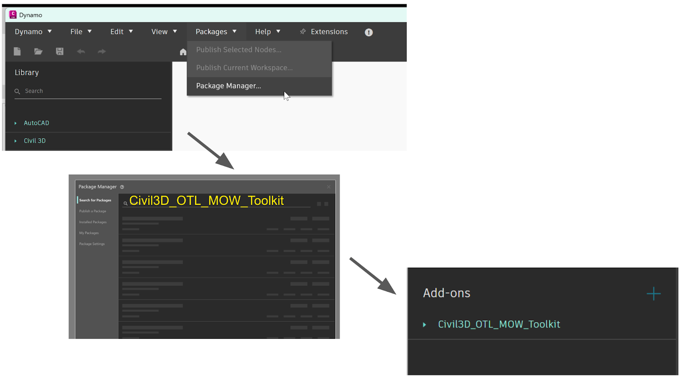

# Civil3D_OTL_MOW_Toolkit

**De Civil3D_OTL_MOW_Toolkit kan het makkelijkst vanuit Dynamo geinstalleerd worden door in de package manager te zoeken op 'Civil3D_OTL_MOW_Toolkit'.**

Functies voor het werken met OTL data in Civil3D via Dynamo: Kan afgeladen worden als .dyn files, 
of als package met custom nodes gebruikt worden. 

 De toolkit bestaat uit enkele custom nodes (scripts), verzameld in een ‘package’, 
wat ervoor zorgt dat de OTL-data gekoppeld kan worden aan Civil 3D-objecten aan de hand van Property Sets.

 Alle python code die in de dynamo workspaces vervat zit is hier ook als aparte .py file opgenomen

 De nieuwe versie van de OTL_MOW_Toolkit biedt krachtige verbeteringen voor een vlottere en efficiëntere workflow: van verbeterde integratie met het AWV DAVIE-dataportaal, door te vertrekken vanuit een DAVIE-download, en duidelijkere foutmeldingen tot ondersteuning voor recentere Civil 3D-versies. Wat kan je vanaf nu nog doen?

  - Sneller OTL-propertysets aanmaken met OTL_Create_propertset_definitions (voor Civil3D 2025 en nieuwer)
  - Het in bulk aanpassen van attribuutwaarden met OTL_Set_attribute_value
  - OTL-data downloads inladen met OTL_Create_objects_from_csv
  - Data filteren op OTL aanwezigheid, handle, type of id met OTL_Select_objects
  - OTL-data uit de .dwg exporteren naar CSV, om deze data in te zetten in andere processen. Bijvoorbeeld om te gebruiken in de OTL wizard 2, met OTL_Export_psetdata_to_csv
  - Een OTL-propertyset aan objecten koppelen a.d.h.v. hun AutoCAD-layer, met OTL_Pset_by_layermapping

  Naast enkele nieuwe functionaliteiten, kreeg de MOW_OTL_Toolkit ook backend een technische upgrade. 
Door gebruik te maken van het ‘OTL MOW Python Library’-systeem, heeft de MOW_OTL_Toolkit vanaf nu een snellere werking en een robuustere backend.
Vervolgens krijg je ook duidelijkere feedback, foutmeldingen door pop-up berichten en is er geen afhankelijkheid meer van een extra Autodesk library.
